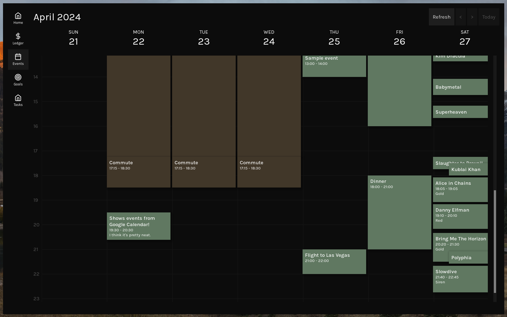
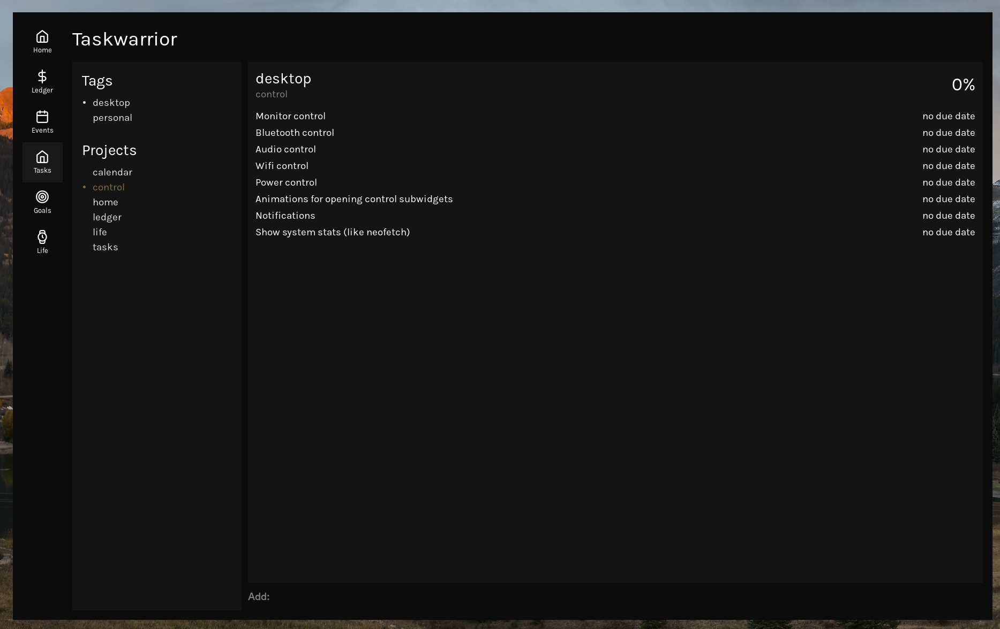
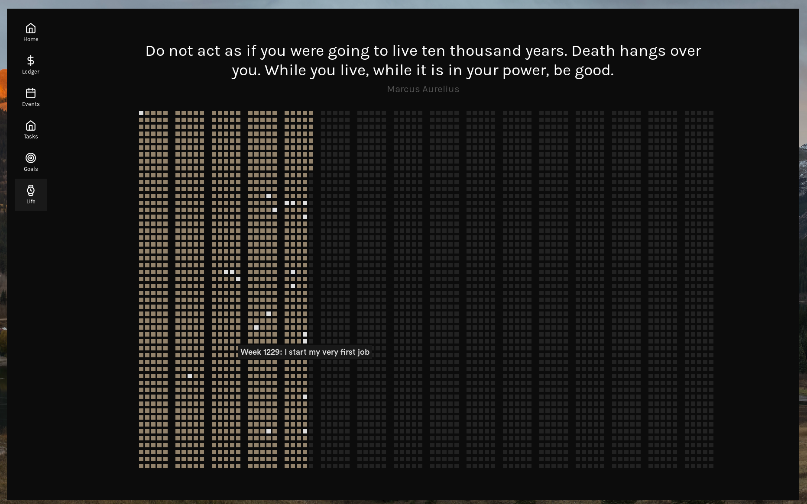

# Dotfiles

## Overview
- Distro: NixOS
- WM: Hyprland
- Widgets: ags
- Editor: nvim
- Browser: qutebrowser

## Dashboard
Made entirely with ags.

### Calendar week view
Uses data from gcalcli.

### Tasks

### Goals
Goals are defined in a separate TaskWarrior directory.

### Life calendar
A morbid way to put my life into perspective.

## Acknowledgements
(People I have stolen from)
- [misterio77 minimal nix starter config](https://github.com/Misterio77/nix-starter-configs)
- [fufexan](https://github.com/fufexan/dotfiles)
- [leowercase](https://github.com/leowercase/dotfiles)
- [budimanjojo](https://github.com/budimanjojo/dotfiles)
