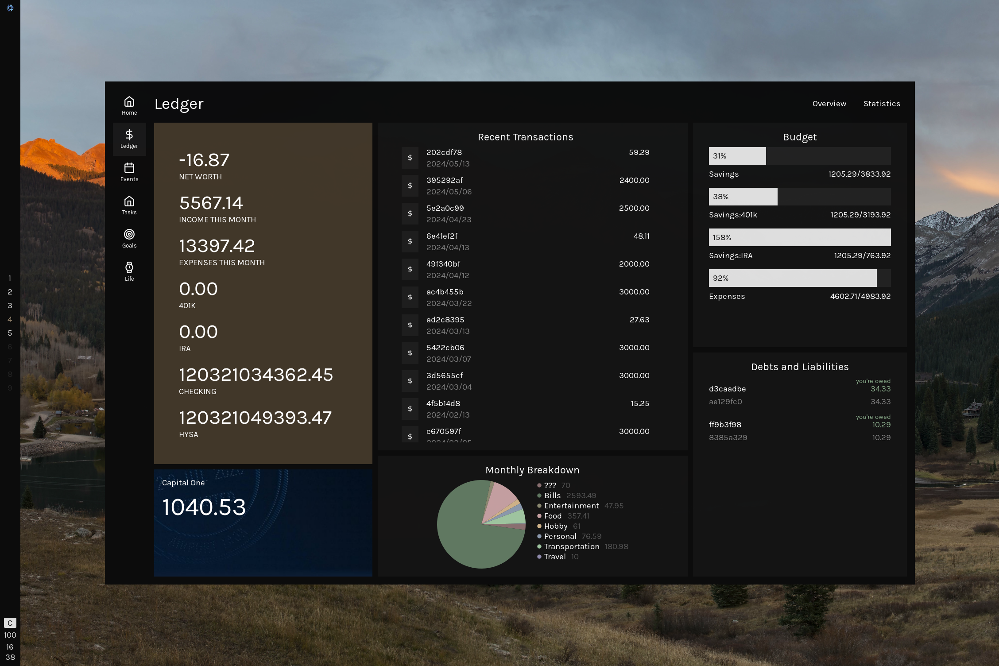

# Dotfiles

## Overview

- Distro: NixOS
- WM: Hyprland
- Widgets: ags
- Editor: nvim
- Browser: qutebrowser

## Dashboard

### Calendar week view
Uses data from Google Calendar fetched with [gcalcli](https://github.com/insanum/gcalcli).

### Ledger
This uses data from [ledger-cli](https://github.com/ledger/ledger), a plain-text accounting system.

### Tasks
Just a fancy frontend for [Taskwarrior](https://github.com/GothenburgBitFactory/taskwarrior).

### Goals
It's nice for me to have an easily accessible (and aesthetic) reminder of what I do it all for.

The data for this is stored in a separate Taskwarrior directory.

Clicking each item reveals a sidebar showing more information about the selected goal.

### Life calendar
A morbid way to put my life into perspective.

---

## Acknowledgements
(People I have stolen from)
- [misterio77 minimal nix starter config](https://github.com/Misterio77/nix-starter-configs)
- [fufexan](https://github.com/fufexan/dotfiles)
- [leowercase](https://github.com/leowercase/dotfiles)
- [budimanjojo](https://github.com/budimanjojo/dotfiles)
